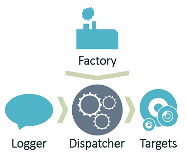

.. rst-class:: center

.. image:: sitetitle.png

----

########################
  Architectural Overview
########################

.. _arch_overview:

Factory, Logger, Dispatcher and Targets
=======================================

.. rst-class:: center

----

Overview
--------

* **Factory** - Responsible for building loggers, the dispatcher, and everything the dispatcher depends on.  NuLog conforms to the `Dependency Inversion Principle <https://en.wikipedia.org/wiki/Dependency_inversion_principle>`_, forcing all the construction up to the factory.
* **Logger** - Constructed by the factory, and given a reference to a dispatcher, the logger is responsible for building log events and passing them to the dispatcher.
* **Dispatcher** - Responsible for receiving log events and managing them in a queue, telling them to log to certain targets at the appropriate times, based on the configured rules.
* **Targets** - Targets are responsible for writing log events to their medium, such as trace, console, text file, or a plethora of others.

Log Event Lifecycle
-------------------

  #. Application code calls a `Logger`, sending data over to be converted into a `LogEvent`.

  #. The `Logger` converts the data into a `LogEvent` and passes it to the logger's `Dispatcher`, either for immediate, or deferred dispatch.

  #. The `Dispatcher` receives the `LogEvent`, and either sends it immediately, or places it into a queue to be dispatched later.

  #. The `Dispatcher`, either immediately, or as it works through its queue, figures out which targets each log event needs to go to, based on the tags on the log event, and the configured rules.

  #. The `Dispatcher` then tells the `LogEvent` to present itself to the appropriate `Target` instances for writing (observer pattern).

.. _arch_princ:

Architectural Principles
========================

Here are our guiding principles, for the NuLog project.  These principles come together to form the "philosophy" of the project:

  #. **Simple** - Period.  Avoid introducing complexity until it is *necessary*, and no sooner.  It is the simplicity of the framework that gives it power.
  
  #. **NuLog is a Logging Framework** -  Not a message bus or queue.  NuLog shouldn't be handling notifications out to your end users, or acting as a bus to deliver messages between your application's tiers.
  
  #. **Unassuming** - NuLog needs to stay out of the way.  If NuLog breaks, it needs to break "silently" without letting exceptions bubble up.  Leveraging NuLog cannot get in the way of the developer, but must instead, support the developer.  NuLog is a useful tool.  NuLog must not be a helpful tool.  Useful tools require the developer to take action, whereas helpful tools take action on behalf of the developer.
  
  #. **Tag-Based** - Offers more simplicity, and more flexibility, than the traditional "level" based logging.
  
  #. **Extensible** - Build using the 'Dependency Inversion Principle <https://en.wikipedia.org/wiki/Dependency_inversion_principle>'_.  Developers who leverage the framework must be able to replace any portion of the framework with their own pieces, given that they conform to the 'Liskov Substitution Principle <https://en.wikipedia.org/wiki/Liskov_substitution_principle>'_.
  
  #. **SOLID Principles** - We adhere to the 'SOLID Principles <https://en.wikipedia.org/wiki/SOLID_(object-oriented_design)>'_, as best we reasonably can.

  #. **Business-Driven-Development** - We believe that the best documentation of a system are well written unit and integration tests.  We demand that there be *near* complete code coverage, and the checks must be high quality.  All code that can be tested, must be done so before said code is written.  Tests are first to document the expected behavior of the code, and second, have an ansilary benifit of verifying that the implementation actually does what is expected.  * **Any code (pull requests, etc.) that is not properly covered will be rejected.** *
  
  #. **Continuous-Integration** - Continuous integration is a **must**.  We recognize and accept that CI is a discipline, and not a set of tools.  We embrace completely the discipline of CI. **This means that if you break it, you fix it:** If you break the build, you are expected to fix the build.  We don't tolerate a broken build being left to rot: if the build breaks, all other changes/work stops until the build is fixed.
  
  #. **Perfromant** - Performance is a high priority of the NuLog project.  This said - code first for readability and maintainability.  After this, use performance analysis tools to identify hot-spots in the code, and very clearly document any "smells" that are *necessary* for performance.  If it isn't *necessary*, don't do it.

  #. **No External Dependencies in the Core Library** - No third-party libraries should be required to use the core of NuLog.  A logging framework shouldn't pull in any other dependencies, and should be unassuming.  This means no *IoC* containers, or even a JSON parsing library.  The core project needs to only reference the standard .Net assemblies.

  #. **External Dependencies in Extension Libraries** - Extenral dependencies need to be brought in through extension libraries.  An example of this would be a separate project for a target which posts log events to a `Slack <https://slack.com/>`_ channel.

  #. **NO TOLERANCE FOR GPL. PERIOD.** - GPL is not to come within 1,000 miles of NuLog.  GPL is a cancer the likes this world hasn't seen before, and as *mamma says, GPL is the devil*.  But-**NO.  PERIOD.**  We prefer MIT and Apache 2.0 around here.  This same policy applies for any and all *copyleft* style licenses, which are designed to restrict your freedom and rights, as opposed to protecting them.

----

Architectural Policies
======================

These policies are more fluid than the principles, and are therefore, more flexible, and change more frequently.  They are also more detailed in nature.  These help to refine the vision set forth by the principles:

  #. **Fallback Loggers Should be Independent** - The fallback loggers should not leverage the targets, or other parts of the NuLog system, to perform their duties.  The functionality of the fallback loggers need to be completely contained within the fallback loggers.  The reason for this is simple: we need the fallback loggers to work, even when targets and other things are breaking.  If the fallback logger depends on a target's implementation, when that target fails, so will the fallback logger, and consequently, the developer will not be informed of the failure.

  #. **Using FakeItEasy for a mocking framework** - I was tempted to not even use a mocking framework, especially once I saw that Moq had a BSD license. After a little searching, I found FakeItEasy, which is under the MIT license, and has had a fairly active community. Adding a mocking framework won't add any dependencies to NuLog itself, as the tests aren't distributed with the library. FakeItEasy will definitely decrease complexity. Between the loose coupling, the reduction in complexity, and the friendly license, I've decided to leverage FakeItEasy for some of the more complex tests.
  
  #. **Using XUnit for a testing framework** - XUnit has many advanced features, and many of them, before NUnit caught up.  XUnit is fast, and makes for effective and readable tests.

  #. **Simple Email Target: This is for logging, not message queuing** - Not only does it significantly increase the complexity of the target, but for a purpose I believe to be out of scope of the core purpose of NuLog. Adding "advanced" features would encourage the abuse of the logging system, as use as a notification engine - which NuLog is not. This doesn't prevent a later "extended" email target (as an add-on package, or 3rd party contribution, perhaps).
