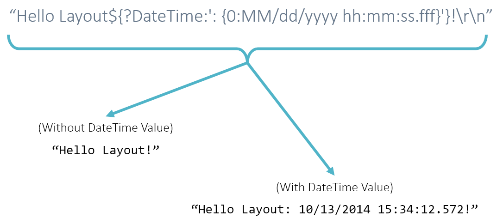
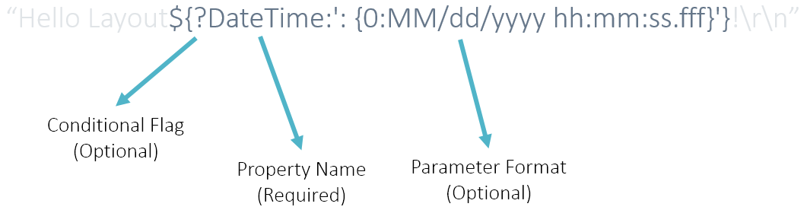

.. rst-class:: center

.. image:: sitetitle.png

----

.. _standardlayout:

####################
  Layouts/Log Format
####################

Introduction to Layouts
=======================
Layouts are a mechanism for converting log events into text, and are used by many of the built-int targets, such as the `ConsoleTarget`, `TextFileTarget` and even the `MailTarget`.  The default "standard" layout implementation uses a format string to define how the layouts are defined. Layouts are used by the standard text-based targets that are included with the framework (including the email target). Custom layouts can be implemented and used in the framework. This documentation focuses on the standard layout.

Layouts are a combination of static text and layout parameters. Static text is anything that is not wrapped in a property enclosure :code:`${}`. Static text will always show in a log event formatted by the layout. Escaped characters are supported, and *suggested*, as newline characters are not automatically included at the end when a log event is being printed.

----

Special Parameters
==================
There are some special parameters, that recieve special treatment when used:

  * **${Tags}** - Produces a comma delimited list of all of the tags assigned to the log event.
  * **${Exception}** - Produces special formatting of the exception associated with the log event - specifically, each inner exception will be listed, traversing down the chain.

----

Anatomy of a Layout Parameter
=============================
Parameters are wrapped with the property enclosure: :code:`${}`. A Single parameter in the layout format refers to a single property in the log event. Parameters have three parts:

Let's explore:
  #. **The Conditional Flag - *Optional*** - The conditional flag is a single :code:`?` located at the front of the property, inside the property property enclosure :code:`${}`. If the conditional flag is present, the property will only be included in the resulting text if the property is not null or empty.
  #. **The Property Name - *Required*** - The name of the property within the log event is located at the beginning of the property string, after the conditional flag. The Property Name value is reflective and recursive, child values can be accessed using periods, for example: :code:`DateTime.Day`. Any "Meta Data" associated with the log event is searched first for the property, by name. The log event is searched for the property by name, if the property is not found in the "Meta Data".
  #. **The Parameter Format - *Optional*** - The property format is used to format the value of the property which was evaluated from the log event. The property format is separated from the property name by a colon: :code:`:`. The property format is wrapped in single quotes to allow for escaping within the format string. The framework uses :code:`System.String.Format` with the property format and value.

----

Conditional Parameters
======================
Using parameter formatting (which we will look at next), extra characters and text can be included in with a parameter. By using the conditional flag, you can tell the layout to only include the formatted text if the parameter identified by the name has a value. Take, for example:

.. image:: conditionalparameters.png

Notice how the resulting text could be different, between :code:`Hello Layout!` and :code:`Hello Layout: 10/13/2014 15:34:12.572!`. The two differences between these are the characters :code:`:` and the date. Because of the conditional flag :code:`?` at the beginning of the parameter is set, the entire formatted text is not included when DateTime has no value, excluding the :code:`:`. This prevents the formatted text from reading :code:`Hello Layout: !` or :code:`Hello Layout: null!` if no date is provided.

----

Formatted Parameters
====================
The format portion of the parameter is separated from the parameter name by the :code:`:` character. The format is wrapped in single quotes :code:`'` and is passed as the pattern or format to the :code:`System.String.Format` function. The first and only parameter passed for formatting is the matched parameter from the log event. The example below shows how we leverage the :code:`System.String.Format` functionality for formatting a :code:`DateTime`:

.. image:: formattedparameters.png

Also notice how in the format string, the date stamp is preceded by two characters - a colon and a space.
